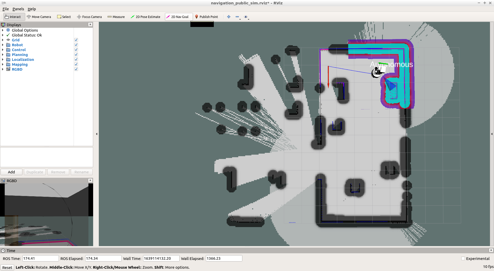
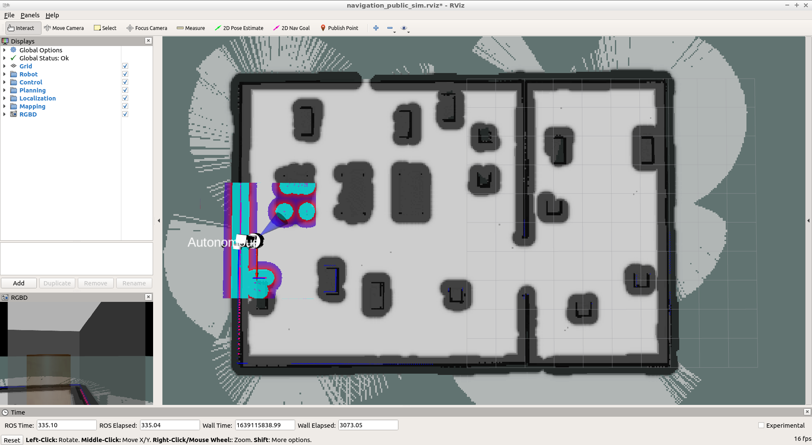

# enpm808x_final_inspection_robot

[](https://app.travis-ci.com/rnvandemark/enpm808x_final_inspection_robot)
[](https://coveralls.io/github/rnvandemark/enpm808x_final_inspection_robot?branch=master)

## Project Overview/Description

**TODO**

## Personnel

### Aditya Jadhav

**TODO**

#### Abhishek Nalawade

**TODO**

#### R. Nick Vandemark

**TODO**

## License

See the license for this project [here](LICENSE.txt).

## Links to Agile Iterative Process (AIP) Products

To Project Backlog (Product Backlog, Iteration Backlogs, and Work Log):

[https://docs.google.com/spreadsheets/d/1DmnGjTfYCdlwXq4yxJ25zSwCLq8LcW4DftqtF5_p5Tk/edit?usp=sharing](https://docs.google.com/spreadsheets/d/1DmnGjTfYCdlwXq4yxJ25zSwCLq8LcW4DftqtF5_p5Tk/edit?usp=sharing)

To Sprint Planning Notes/Review:

[https://docs.google.com/document/d/1JHqd9Alk2kZUKKPmb6cLGOPEvR-gZKouV5svNGUF8SE/edit?usp=sharing](https://docs.google.com/document/d/1JHqd9Alk2kZUKKPmb6cLGOPEvR-gZKouV5svNGUF8SE/edit?usp=sharing)

Furthermore, see the "UML" directory of this package for UML files, and Proposal
deliverables of the initial proposal in the "Proposal" directory.

## Known Issues/Bugs

**TODO**

## Dependencies

The following should install all of the required packages (assuming the proper
sources have been declared, see [ROS Melodic installation](http://wiki.ros.org/melodic/Installation/Ubuntu) otherwise):
```
sudo apt-get update
sudo apt-get install git python-rosinstall ros-melodic-desktop-full python-catkin-tools ros-melodic-joint-state-controller ros-melodic-twist-mux ros-melodic-ompl ros-melodic-controller-manager ros-melodic-moveit-core ros-melodic-moveit-ros-perception ros-melodic-moveit-ros-move-group ros-melodic-moveit-kinematics ros-melodic-moveit-ros-planning-interface ros-melodic-moveit-simple-controller-manager ros-melodic-moveit-planners-ompl ros-melodic-joy ros-melodic-joy-teleop ros-melodic-teleop-tools ros-melodic-control-toolbox ros-melodic-sound-play ros-melodic-navigation ros-melodic-depthimage-to-laserscan ros-melodic-moveit-commander
```

## How to

### Setting Up Your Workspace

- Create a catkin workspace and its src directory at e.g. /path/to/tiago_ws/src
- Clone this package into the src directory:
```
cd /path/to/tiago_ws/src
git clone https://github.com/rnvandemark/enpm808x_final_inspection_robot.git
```
- Navigate to the catkin workspace:
```
cd /path/to/tiago_ws/
```
- Use rosinstall to download additional packages into your workspace, using the
  additional dependencies declare in this repository's rosinstall file:
```
# If needed, replace 'enpm808x_final_inspection_robot' with the local name you
# gave this repository
rosinstall src /opt/ros/melodic src/enpm808x_final_inspection_robot/dependencies.rosinstall
```
- Set up rosdep and ensure any missing dependencies required by this workspace
  are met/installed:
```
sudo rosdep init
rosdep update
cd /path/to/tiago_ws/
rosdep install --from-paths src --ignore-src -y --rosdistro melodic --skip-keys="opencv2 opencv2-nonfree pal_laser_filters speed_limit_node sensor_to_cloud hokuyo_node libdw-dev python-graphitesend-pip python-statsd pal_filters pal_vo_server pal_usb_utils pal_pcl pal_pcl_points_throttle_and_filter pal_karto pal_local_joint_control camera_calibration_files pal_startup_msgs pal-orbbec-openni2 dummy_actuators_manager pal_local_planner gravity_compensation_controller current_limit_controller dynamic_footprint dynamixel_cpp tf_lookup opencv3 joint_impedance_trajectory_controller cartesian_impedance_controller omni_base_description omni_drive_controller"
```
- Optionally, add this to ~/.bashrc (and resource as necessary) to restrict
  message generation for extra languages:
```
export ROS_LANG_DISABLE=genlisp:gennodejs:geneus
```

### Building the Program and Tests

#### Building the Package

- Prerequisite: you have set up your workspace as described in the previous
  section, assuming the catkin workspace at e.g. /path/to/tiago_ws/
- Navigate to the catkin workspace and build with the build script:
```
cd /path/to/tiago_ws/
./src/enpm808x_final_inspection_robot/bin/build-ws.sh
```

#### Building the Tests

The tests for this package are automatically built with the aforementioned
build script, build-ws.sh. See the 'Building the Package' section.

### Running a Sample of the Program

There are two steps to running the program. The first step, building a digital
map of the environment, only has to be done once (but can be done multiple
times). Then, every time the 'main' program is ran, it will use the saved map.
There are launch files for each of these routines.

- Prerequisites:
  - You have set up your workspace as described in the 'Setting Up Your
    Workspace' section, assuming the catkin workspace at e.g.
    /path/to/tiago_ws/
  - You have built the package as described in the 'Building the Package'
    section
- For each terminal opened, make sure your ROS installation and this workspace
  are sourced, for example:
```
source /opt/ros/melodic/setup.bash
source /path/to/tiago_ws/install_isolated/setup.bash
```

#### Creating a Map of the Environment

First, launch the mapping configuration with the following command:
```
roslaunch enpm808x_final_inspection_robot create_map.launch
```

This will start Gazebo, RViz, and multiple TIAGo nodes/utilities. The map is
initially empty, and we will have the TIAGo navigate around the environment to
build it. To move the robot around, navigate to the RViz window and use the '2D
Nav Goal' tool:



This can be clicked anywhere on the map that has already has been mapped (white
pixels). Move around until the map is fully populated, i.e. all floors and
walls/obstacles are mapped:



IN A NEW TERMINAL, run the following command to save the map you have created:
```
rosservice call /pal_map_manager/save_map "directory: ''"
```

This will save the map at ~/.pal/tiago_maps/config. Confirm it exists. Then,
all terminals' processes can be stopped. Record the absolute file path that the
map files are saved at, e.g. the output of the service call may look like:
```
success: True
name: "2021-12-10_021714"
full_path: "/home/lu18/.pal/tiago_dual_maps/"
message: "Map saved: 2021-12-10_021714"
```

So you should record the path as the concatenation of the full path, its name,
and another 'configurations' subdirectory
```
/home/lu18/.pal/tiago_dual_maps/configurations/2021-12-10_021714
```

#### Running a Demo of the Main Program

Prerequisite: you have created a map as described in the previous section

Launch the main program's configuration with the following command:
```
# Replace '/path/to/maps' with the path to the map data, the example in the
# previous section was '/home/lu18/.pal/tiago_dual_maps/2021-12-10_021714'
roslaunch enpm808x_final_inspection_robot main.launch map:="/path/to/maps"
```

This will start Gazebo with the specified map, RViz, multiple TIAGo
nodes/utilities, and nodes created in this project. There are multiple optional
arguments for this launch file:
- view_image: '1' to also display the raw RGB image in a separate window, '0'
  otherwise. Default value is '0'.
- robot: The TIAGo robot model to use, either 'steel' or 'titanium'. Default
  value is 'titanium'.
- tiago_start_pose: The pose, relative to the world/map frame, to start the
  TIAGo at. Default value is '-x 0.0 -y 0.0 -z 0.0 -R 0.0 -P 0.0 -Y 0.0'.
- extra_gazebo_args: Any additional arguments to also send to Gazebo. The
  default value is none.

Then, cans for inspection must be spawned. There is a demo launch file to spawn
a fixed set of cans: 'demo.launch'. The launcher 'spawn_cans_from_list.launch'
can be used to spawn a dynamically typed list. For example, this spawns three
cans each with a couple of characteristics:
```
roslaunch enpm808x_final_inspection_robot spawn_cans_from_list.launch can_args_list:="1,1.0,1.0,0.0 : 0,2.0,1.0,0.0 : 1,-1.0,5.0,0.2"
```

The characteristics for each can are separated by a colon, and each individual
characteristic is separated by a comma. These are as follows:
- Whether the can is nominal (1) or defective (0).
- The remaining three are the {x,y,z} coordinates of the initial spawn point,
  in meters, relative to the map's coordinate system.

### Running the Tests

The tests for this package can be ran by navigating to the project workspace
directory and running the helper script:
```
cd /path/to/tiago_ws/
./src/enpm808x_final_inspection_robot/bin/run-tests.sh
```

### Generating Doxygen Docs

There is a Doxygen configuration file in the project's root directory,
_.doxyfile_. The output is generated in the _docs/doxygen/_ directory. There is
already sample documentation there, but updated documentation can be generated
with the following command:
```
doxygen .doxyfile
```
